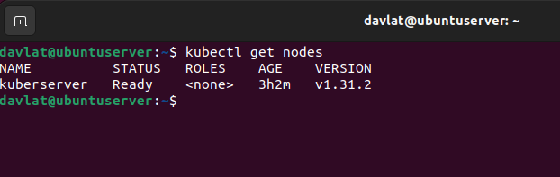
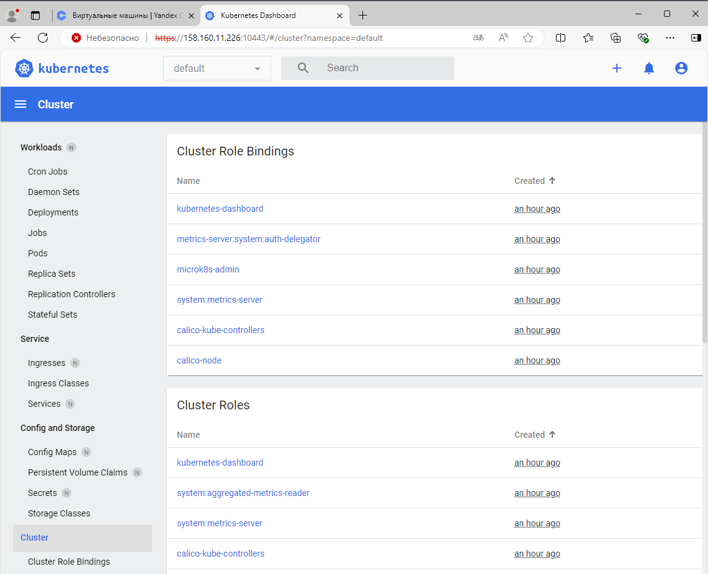

## Домашнее задание к занятию «Kubernetes. Причины появления. Команда kubectl»

### Задание 1. Установка MicroK8S

1. Установить MicroK8S на локальную машину или на удалённую виртуальную машину.
2. Установить dashboard.
3. Сгенерировать сертификат для подключения к внешнему ip-адресу.

------
### Задание 2. Установка и настройка локального kubectl

1. Установить на локальную машину kubectl.
2. Настроить локально подключение к кластеру.
3. Подключиться к дашборду с помощью port-forward.

------
### Решения по заданиям 1,2  

Скриншот вывода команды `kubectl get nodes`:  
  

Скриншот дашборда:  
