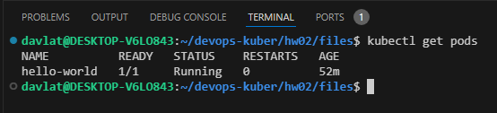

## Домашнее задание к занятию «Базовые объекты K8S»

### Задание 1. Создать Pod с именем hello-world
Скриншот вывода команды `kubectl get pods`:  
  

Скриншот подключения к Pod в браузере:    

Ссылка на манифест [create_pod.yml](./files/create_pod.yml).

### Задание 2. Создать Service и подключить его к Pod
Скриншот вывода команды `kubectl get svc`:  
  

Скриншот вывода команды `kubectl port-forward svc/netology-svc 3000:80`:  
  

Скриншот подключения к netology-svc в браузере:    
  

Ссылка на манифест [create_service.yml](./files/create_service.yml).