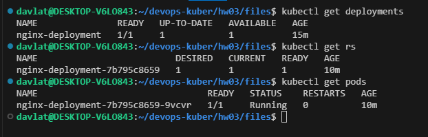
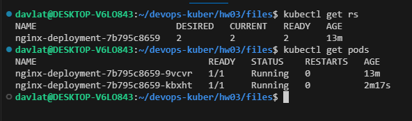
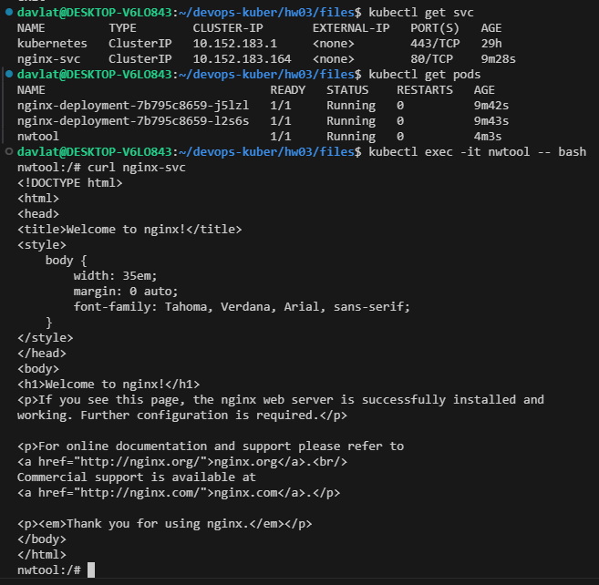
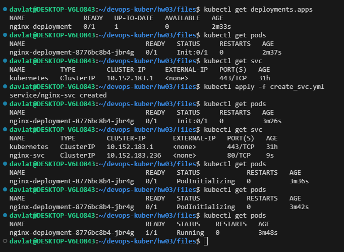

### Домашнее задание к занятию «Запуск приложений в K8S»

### Задание 1. Создать Deployment и обеспечить доступ к репликам приложения из другого Pod
Скриншот состояния до масштабирования:  
  

Скриншот состояния после масштабирования:    

Скриншот подключения к поду и выполнения команды `curl` для доступа к приложению:      

Ссылка на манифест deployment [create_deployment_1.yml](./files/create_deployment_1.yml).  
Ссылка на манифест service [create_svc.yml](./files/create_svc.yml).

### Задание 2. Создать Deployment и обеспечить старт основного контейнера при выполнении условий
Скриншот состояния пода до и после запуска сервиса:  
  

Ссылка на манифест deployment [create_deployment_2.yml](./files/create_deployment_2.yml).  
Ссылка на манифест service [create_svc.yml](./files/create_svc.yml).