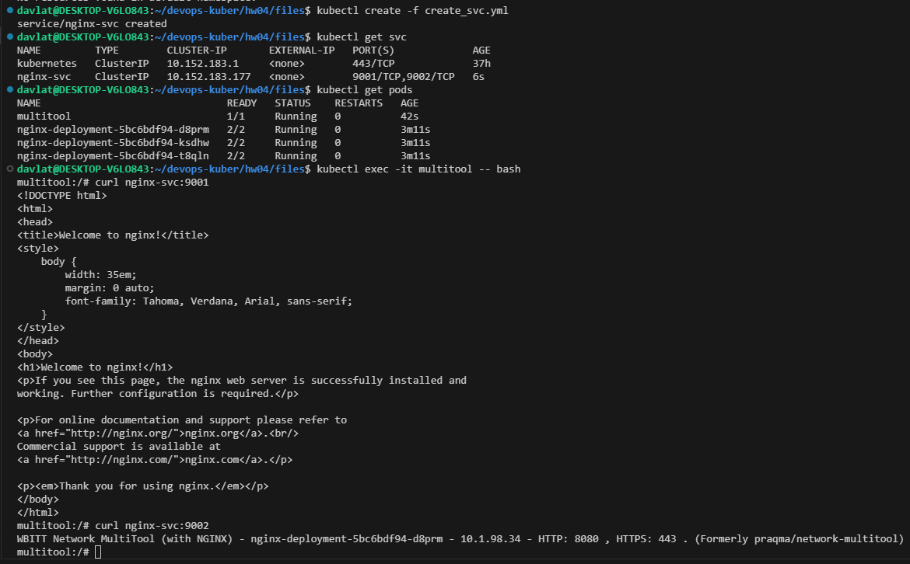
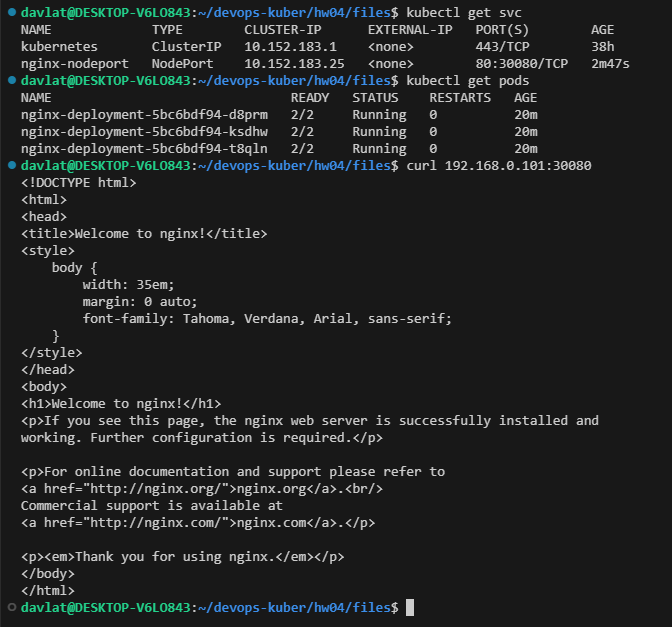

## Домашнее задание к занятию «Сетевое взаимодействие в K8S. Часть 1»

### Задание 1. Создать Deployment и обеспечить доступ к контейнерам приложения по разным портам из другого Pod внутри кластера
Скриншот вывода команды `curl` по доменному имени на порты 9001 и 9002:  
  

Ссылка на манифест deployment [create_deployment.yml](./files/create_deployment.yml).  
Ссылка на манифест service [create_svc.yml](./files/create_svc.yml).

### Задание 2. Создать Service и обеспечить доступ к приложениям снаружи кластера
Скриншот вывода команды `curl` на хост ноды на порт 30080:  
  

Ссылка на манифест service [create_svc_nodeport.yml](./files/create_svc_nodeport.yml).