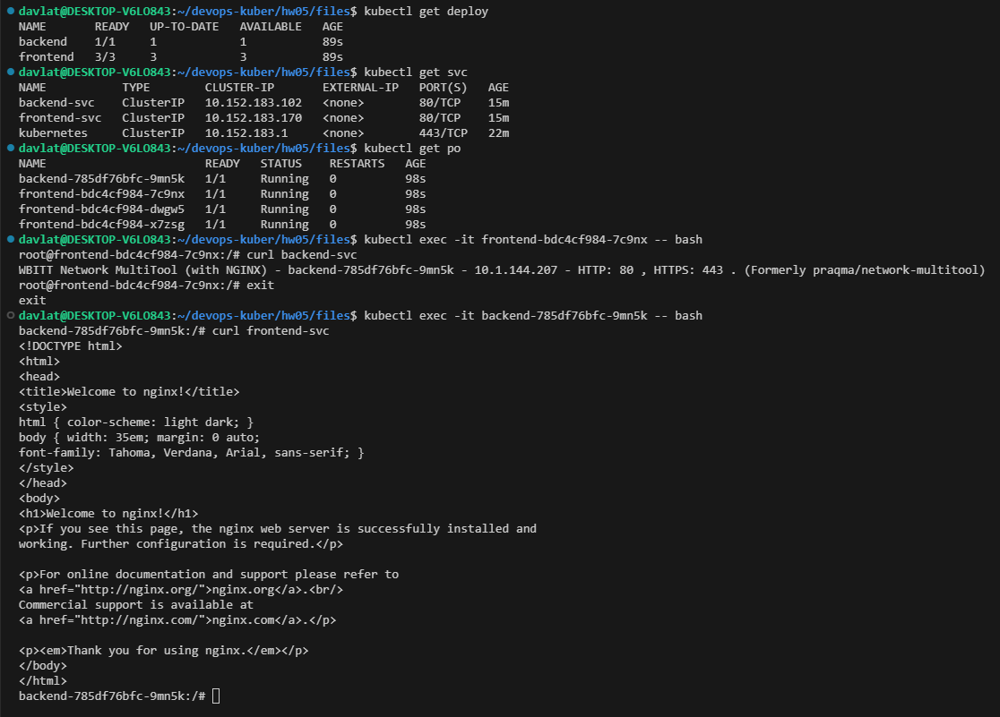
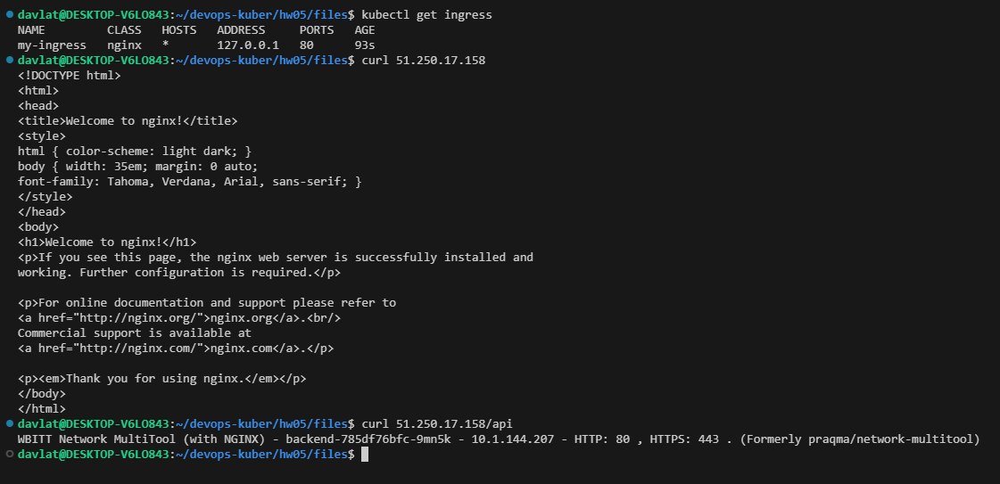
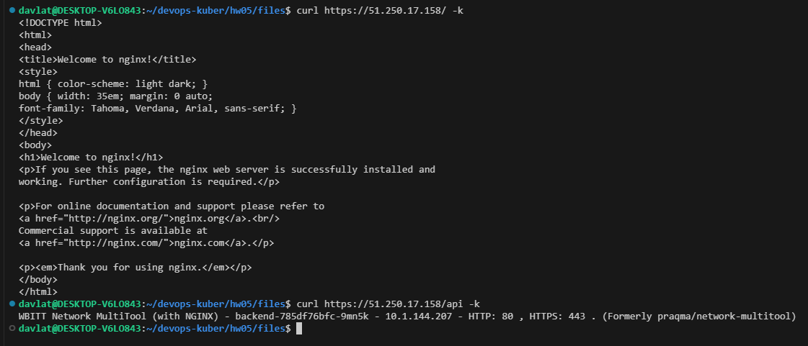

## Домашнее задание к занятию «Сетевое взаимодействие в K8S. Часть 2»

### Задание 1. Создать Deployment приложений backend и frontend
Скриншот доступности между подами:  
  

Ссылка на манифест deployment [create_deploy.yml](./files/create_deploy.yml).  
Ссылка на манифест service [create_svc.yml](./files/create_svc.yml).

### Задание 2. Создать Ingress и обеспечить доступ к приложениям снаружи кластера
Скриншот вывода команды `curl` на эндпоинты `/` и `/api`:  
  

Скриншот вывода команды `curl` на эндпоинты `/` и `/api` по протоколу https:  
  

Ссылка на манифест ingress [ingress.yml](./files/ingress.yml).