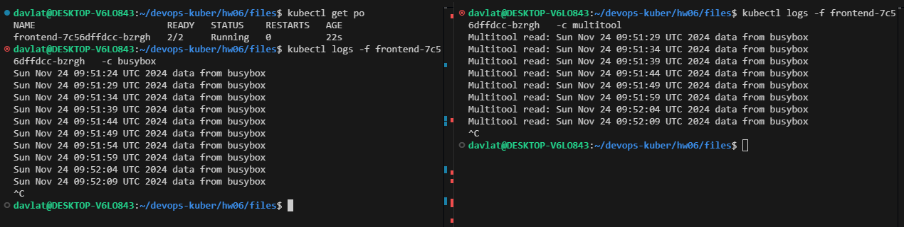
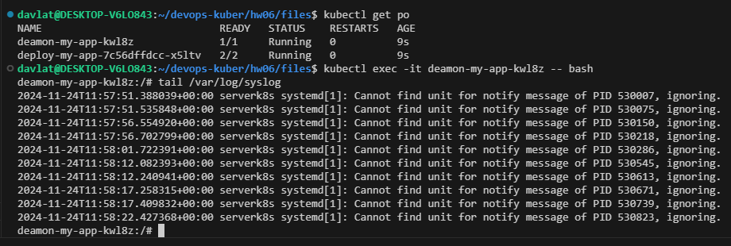

## Домашнее задание к занятию «Хранение в K8s. Часть 1»

### Задание 1. Создать Deployment приложения, состоящего из двух контейнеров и обменивающихся данными
Скриншот чтения/записи контейнерами в файл:  
  

Ссылка на манифест Deployment [deploy.yml](./files/deploy.yml).

### Задание 2. Создать DaemonSet приложения, которое может прочитать логи ноды
Скриншот чтения файла изнутри пода:   
  

Ссылка на манифест DaemonSet [daemonset.yml](./files/daemonset.yml).
