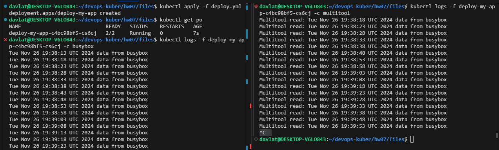
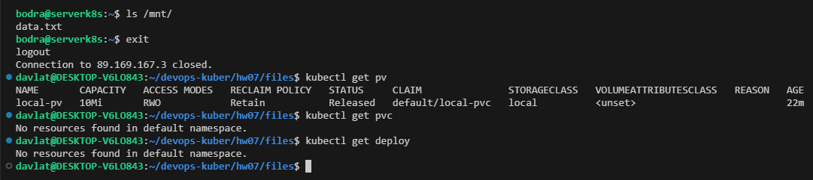
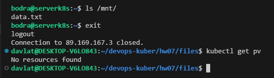
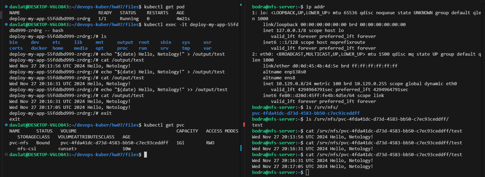

## Домашнее задание к занятию «Хранение в K8s. Часть 2»

### Задание 1. Создать Deployment приложения, использующего локальный PV, созданный вручную
Скриншот чтения/записи контейнерами в файл:  
  

Ссылка на манифест Deployment [deploy_1.yml](./files/deploy_1.yml).  
Ссылка на манифест PV [pv.yml](./files/pv.yml).  
Ссылка на манифест PVC [pvc.yml](./files/pvc.yml).  

После удаления Deployment и PVC - PV и файл сохранился на локальном диске ноды (см. скрин ниже).
  

После удаления PV - файл сохранился на локальном диске ноды, так как ReclaimPolicy установлен в Retain (см. скрин ниже).  
  

### Задание 2. Создать Deployment приложения, которое может хранить файлы на NFS с динамическим созданием PV
Скриншот чтения/записи файла из NFS:  
  

Ссылка на манифест Deployment [deploy_2.yml](./files/deploy_2.yml).  
Ссылка на манифест SC [sc-nfs.yml](./files/sc-nfs.yml).  
Ссылка на манифест PVC [pvc-nfs.yml](./files/pvc-nfs.yml).  
