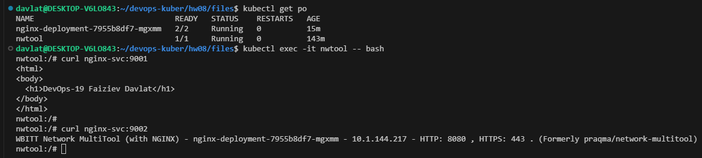
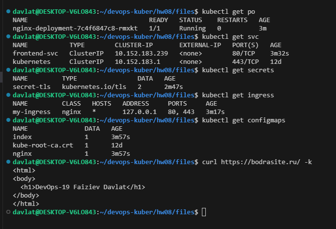

## Домашнее задание к занятию «Конфигурация приложений»

### Задание 1. Создать Deployment приложения и решить возникшую проблему с помощью ConfigMap. Добавить веб-страницу
Скриншот вывода команды `curl`:  
  

Ссылка на манифест Deployment [deploy_1.yml](./files/deploy_1.yml).  
Ссылка на манифест Service [svc_1.yml](./files/svc_1.yml).  
Ссылка на манифест ConfigMap [configmap.yml](./files/configmap.yml).  

### Задание 2. Создать приложение с вашей веб-страницей, доступной по HTTPS 
Скриншот доступа доступ к приложению по `HTTPS`:  
  

Ссылка на манифест Deployment [deploy_2.yml](./files/deploy_2.yml).  
Ссылка на манифест Service [svc_2.yml](./files/svc_2.yml).  
Ссылка на манифест ConfigMap [configmap.yml](./files/configmap.yml).  
Ссылка на манифест Secret [secret.yml](./files/secret.yml).  
Ссылка на манифест Ingress [ingress.yml](./files/ingress.yml).  