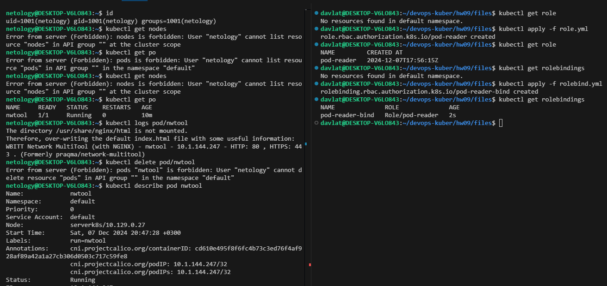

## Домашнее задание к занятию «Управление доступом»

### Задание 1. Создайте конфигурацию для подключения пользователя
Скриншот команд:  
  

Ссылка на манифест Role [role.yml](./files/role.yml).  
Ссылка на манифест RoleBinding [rolebind.yml](./files/rolebind.yml).